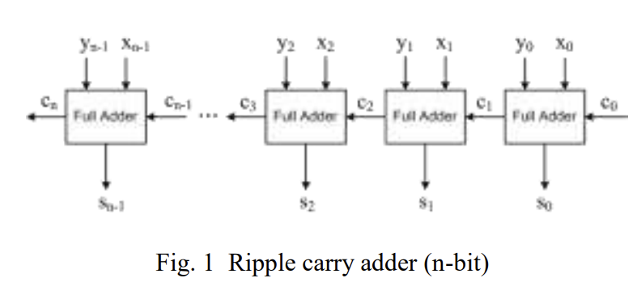
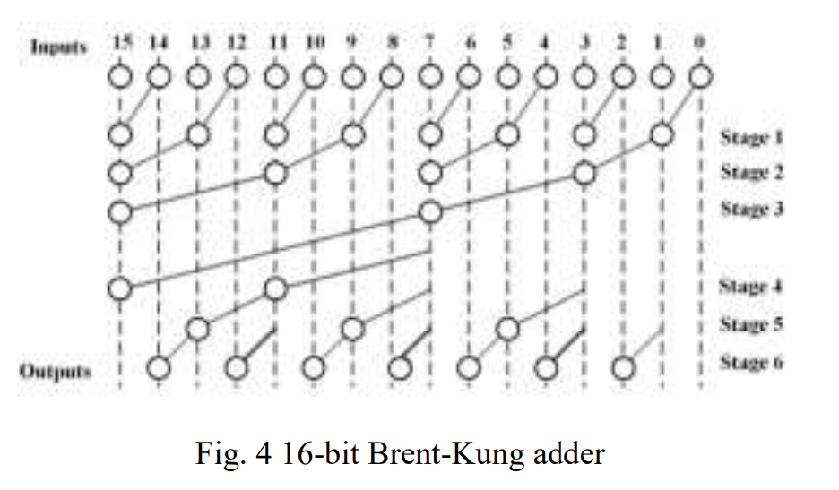
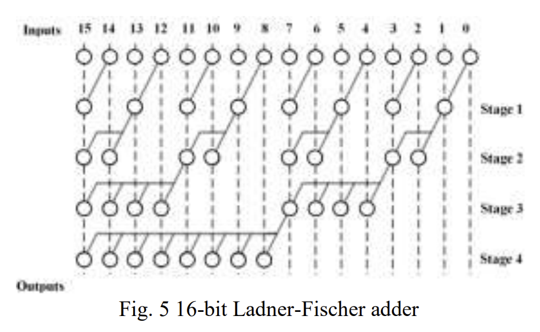
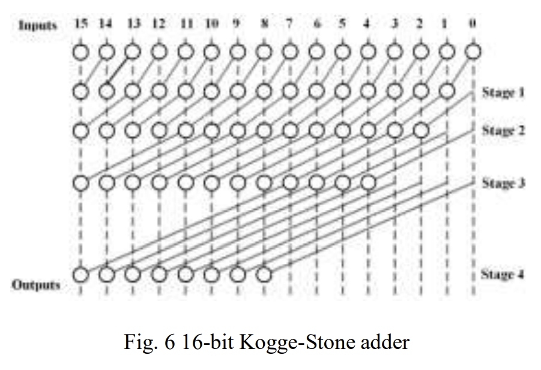
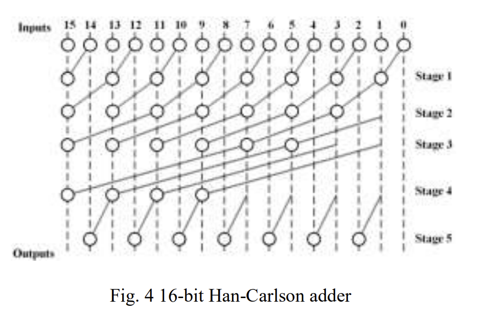
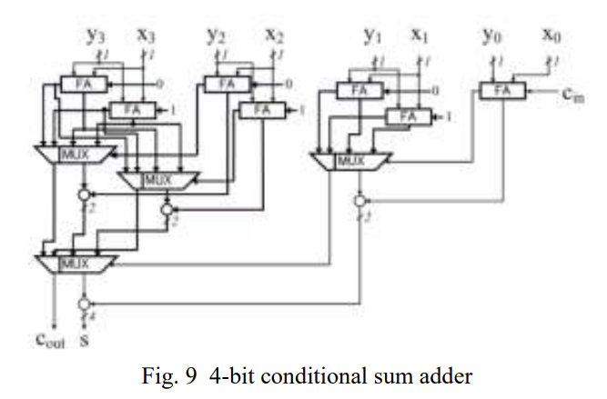

Carry propagation adders hardware implementations
=================================================

List
1. internal (int) (`assign {cout, y} = a + b + cin;`)
2. ripple carry adder (rca) 
3. Brent Kung (bk) 
4. Lander Fischer (lf) 
5. Koggle Stone (ks) 
6. Han Carlson (hc) (k=`$clog2($clog2(N))``) 
7. Han Carlson with fixed k=1 and k=2
8. Conditional sum (cs) split by blocks with k=8 uses "internal" implementations for that blocks. Straightforward implementation leads to $n sqrt(n)$ gate consumption.
9. Conditional sum (csp). Same as previous, but generate linear gates size; 

Results
=======

Uses [siliconcompiler](https://www.siliconcompiler.com/) with PDK "asap7", internally uses "yosys" and "openroad".

[//]: # (not all runs was successful)
[//]: # (| bits | name | pipeline step | error   | fmax before step |)
[//]: # (|------|------|---------------|---------|------------------|)
[//]: # (| 256  | bk   | route         | SIGSEGV | 331.90 MHz       |)
[//]: # (| 64   | int  | place         | SIGSEGV | 616.32 MHz       |)
[//]: # (| 512  | hc   | place         | SIGSEGV | 533.01 MHz       |)
[//]: # (| 512  | ks   | place         | SIGSEGV | 539.41 MHz       |)
[//]: # (| 512  | bk   | place         | SIGSEGV | 184.71 MHz       |)
[//]: # (| 512  | lf   | place         | SIGSEGV | 140.64 MHz       |)
 

Successful run sorted by fmax:

| bits | name    | fmax (Hz)  | total area (um^2) | cell area (um^2) | total power (mw) | cells |
|------|---------|------------|-------------------|------------------|------------------|-------|
| 64   | *hc*    | 861524000  | 987.708           | 135.784          | 2.7419e-05       | 1047  |
| 64   | ks      | 839028000  | 1216.89           | 162.829          | 2.91623e-05      | 1309  |
| 64   | hc_1k   | 776311000  | 997.928           | 136.075          | 2.78347e-05      | 1052  |
| 64   | bk      | 720871000  | 999.634           | 136.673          | 2.69754e-05      | 1050  |
| 64   | hc_2k   | 671988000  | 969.133           | 133.145          | 2.72863e-05      | 1022  |
| 64   | lf      | 649157000  | 1021.94           | 140.391          | 2.73897e-05      | 1071  |
| 64   | rca     | 230634000  | 866.125           | 121.393          | 2.55956e-05      | 992   |
| 128  | *ks*    | 757130000  | 2631.69           | 338.81           | 6.16858e-05      | 2746  |
| 128  | hc_1k   | 719042000  | 2141.64           | 279.921          | 5.73872e-05      | 2111  |
| 128  | hc      | 658924000  | 2018.51           | 270.08           | 5.65534e-05      | 1955  |
| 128  | hc_2k   | 589312000  | 1991.92           | 262.644          | 5.57917e-05      | 1932  |
| 128  | bk      | 428834000  | 1994.33           | 266.07           | 5.43773e-05      | 1920  |
| 128  | lf      | 401456000  | 2082.1            | 276.014          | 5.54764e-05      | 1980  |
| 128  | rca     | 114664000  | 1731.14           | 233.105          | 5.10166e-05      | 1808  |
| 256  | *ks*    | 648635000  | 5842.61           | 733.666          | 0.00012986       | 6044  |
| 256  | hc      | 604391000  | 4074              | 526.425          | 0.00011226       | 3827  |
| 256  | lf      | 229537000  | 4234.1            | 545.977          | 0.000111535      | 3926  |
| 512  | ks      | 516416000  | 12440.5           | 1547.16          | 0.000271223      | 12666 |
| 512  | lf      | 141624000  | 8541.63           | 1094.94          | 0.00022692       | 7701  |
| 32   | *cs*    | 1212650000 | 569.67            | 75.1599          | 1.58012e-05      | 660   |
| 32   | hc_1k   | 1104380000 | 483.021           | 66.5431          | 1.35808e-05      | 529   |
| 32   | bk      | 1029700000 | 490.18            | 66.9659          | 1.31513e-05      | 532   |
| 32   | hc      | 1029290000 | 490.18            | 67.1409          | 1.31399e-05      | 532   |
| 32   | hc_2k   | 958594000  | 480.659           | 66.4265          | 1.33601e-05      | 522   |
| 32   | int     | 926423000  | 494.962           | 67.5054          | 1.32424e-05      | 591   |
| 32   | ks      | 915605000  | 527.942           | 70.6984          | 1.38889e-05      | 574   |
| 32   | lf      | 773214000  | 492.571           | 67.3596          | 1.32058e-05      | 535   |
| 32   | rca     | 466051000  | 432.224           | 60.507           | 1.27309e-05      | 513   |
| 16   | cs      | 1618910000 | 257.206           | 36.1438          | 6.90435e-06      | 335   |
| 16   | *bk*    | 1542510000 | 236.852           | 33.9714          | 6.46972e-06      | 292   |
| 16   | hc_2k   | 1539910000 | 236.852           | 33.7964          | 6.47567e-06      | 292   |
| 16   | hc      | 1539910000 | 236.852           | 33.7964          | 6.47567e-06      | 292   |
| 16   | hc_1k   | 1468210000 | 231.064           | 33.7235          | 6.56837e-06      | 286   |
| 16   | ks      | 1503570000 | 262.44            | 36.9166          | 6.74119e-06      | 318   |
| 16   | int     | 1473150000 | 245.236           | 34.8462          | 6.48895e-06      | 327   |
| 16   | lf      | 1466860000 | 240.176           | 34.715           | 6.47094e-06      | 298   |
| 16   | rca     | 882901000  | 214.151           | 31.5511          | 6.31634e-06      | 287   |
| 8    | *ks*    | 2287850000 | 118.973           | 18.1084          | 3.23333e-06      | 173   |
| 8    | cs      | 2344320000 | 112.018           | 16.6941          | 3.10738e-06      | 169   |
| 8    | lf      | 2208630000 | 116.64            | 17.6126          | 3.21369e-06      | 169   |
| 8    | bk      | 2177870000 | 112.587           | 17.3065          | 3.18365e-06      | 166   |
| 8    | hc      | 2172770000 | 112.587           | 17.3065          | 3.18137e-06      | 166   |
| 8    | hc_2k   | 2172770000 | 112.587           | 17.3065          | 3.18137e-06      | 166   |
| 8    | hc_1k   | 2170330000 | 112.587           | 17.3065          | 3.17843e-06      | 166   |
| 8    | int     | 2075160000 | 116.64            | 17.4668          | 3.1639e-06       | 179   |
| 8    | rca     | 1683150000 | 106.376           | 16.4171          | 3.1024e-06       | 165   |

At first glance it seems that something strange with too many cells with rca.
Manually checked `setup.topN.rpt` shows chain of `FAx1_ASAP7_75t_R` with `INVx2_ASAP7_75t_R` length of 30, which is what we want for that design.
But expect much less cells usage. 
That is submodules count in `rca32` implementation (`build/rtl_rca32/job0/export/1/outputs/rtl_rca.vg`)

| count | name                     |
|-------|--------------------------|
| 12676 | FILLER_ASAP7_75t_R       |
| 189   | INVx2_ASAP7_75t_R        |
| 154   | TAPCELL_ASAP7_75t_R      |
| 143   | FILLERxp5_ASAP7_75t_R    |
| 96    | DFFLQNx1_ASAP7_75t_R     |
| 30    | FAx1_ASAP7_75t_R         |
| 26    | CKINVDCx8_ASAP7_75t_R    |
| 9     | BUFx4_ASAP7_75t_R        |
| 5     | INVx8_ASAP7_75t_R        |
| 1     | XOR2x1_ASAP7_75t_R       |
| 1     | XNOR2x1_ASAP7_75t_R      |
| 1     | HAxp5_ASAP7_75t_R        |
| 1     | CKINVDCx9p33_ASAP7_75t_R |

Total 513 (without both "Fillers" types).

Citation
========
Images from [1].

[1] Turcanik, Michal. (2019). Speed Comparison of the Adders in FPGA. 8. 18-23. 